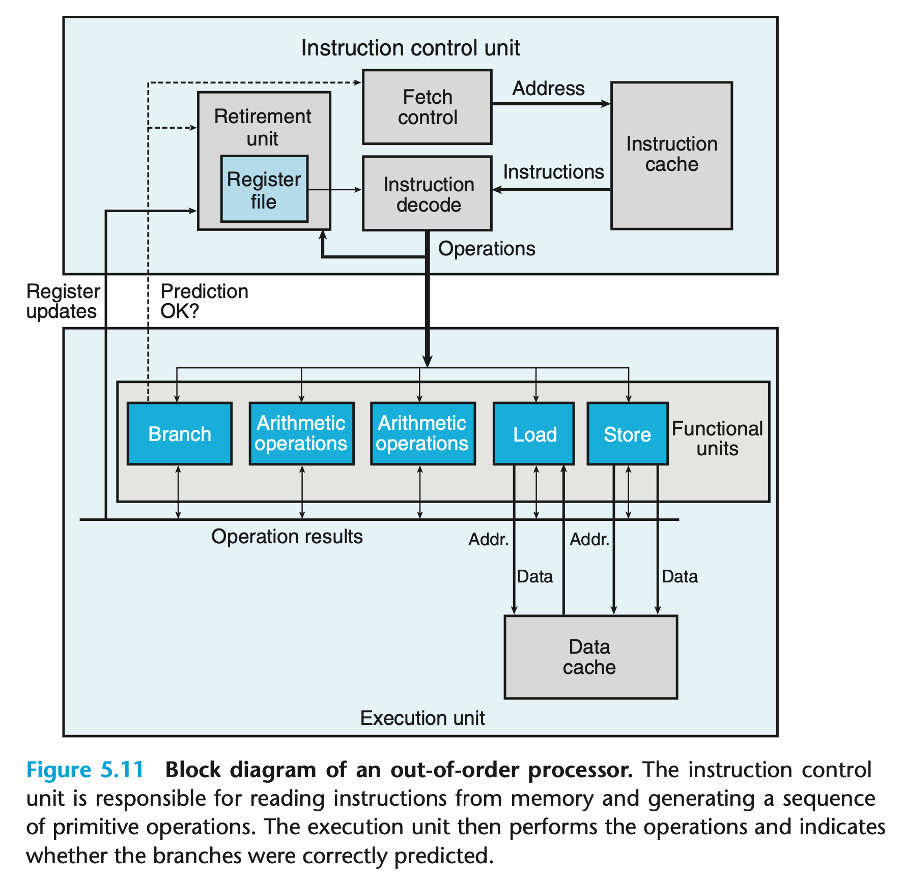

## 优化程序性能

在看到了程序的机器级表示之后，我们就会明白每一行代码都会被编译成指令并输送给 CPU 执行，而 CPU 执行每一条指令都是有开销的。

在这种情况下，一些在代码中看起来无关紧要、大同小异的代码，虽然可以实现相同的功能，在性能表现上可能是天差地别的。

我们可以应用一些基本的优化方法，尤其是在循环的逻辑中，来避免一些没有意义的开销。

### 减少过程调用

如果被调用的方法与 n 无关，则也应该考虑把方法提取到循环外，而非在循环内调用。

考虑下面的代码：

```c
/* Convert string to lowercase: slow */
void lower1(char *s)
{
    long i;
    for (i = 0; i < strlen(s); i++)
        if (s[i] >= ’A’ && s[i] <= ’Z’)
            s[i] -= (’A’ - ’a’);
}

/* Convert string to lowercase: faster */
void lower2(char *s)
{
    long i;
    long len = strlen(s);
    for (i = 0; i < len; i++)
        if (s[i] >= ’A’ && s[i] <= ’Z’)
            s[i] -= (’A’ - ’a’);
}

/* Sample implementation of library function strlen */
/* Compute length of string */
size_t strlen(const char *s)
{
    long length = 0;
    while (*s != ’\0’) {
        s++;
        length++; 
    }
    return length;
}
```

`strlen` 内部遍历传入的字符串计算 length，如果放到循环中每次都进行访问的话，相当于把一个只需要计算一次的值计算了 n 次，直接将一个 $O(n)$ 级别的方法变成了一个 $O(n^2)$ 的方法。

而是应该像 `lower2` 中一样，将 `lower2` 拿到循环外，只计算一次。

### 减少不必要的内存访问

参考下面的代码，在计算数组元素的总和时，会在循环内不停地用访问 `*dest` 指针：

```c
/* Direct access to vector data */
void combine3(vec_ptr v, data_t *dest) {
    long i;
    long length = vec_length(v);
    data_t *data = get_vec_start(v);
    *dest = 0; 

    for(i = 0; i < length; i++){
        *dest = *dest + data[i];
    }
}
```

对应的代码编译为汇编代码后，也会在循环过程中不停地重复访问内存、做计算、写入内存的操作：

```assembly
.L17:
    ; ...
    vmovsd (%rbx), %xmm0            ; 读取
    vmulsd (%rdx), %xmm0, %xmm0     ; 计算
    vmovsd %xmm0, (%rbx)            ; 写入
    ; ...
    jmp .L17
```

而如果选择引入局部变量，在循环中做计算，并且只在最后对 `*dest` 赋值一次，我们就可以完全省去在循环中访问内存、写入内存的开销。

```c
/* Accumulate result in local variable */
 void combine4(vec_ptr v, data_t *dest)
{
    long i;
    long length = vec_length(v);
    data_t *data = get_vec_start(v);
    data_t acc = 0;

    for(i=0;i<length;i++){
        acc = acc + data[i];
    }
    *dest = acc;
}
```

很明显，对应的汇编代码只会在栈上进行操作，然后在最后写入内存一次即可，甚至不需要单独访问。

### 循环展开

在某些情况下，可以对循环进行更大的步长，在一次循环内访问多个值，从而也达到减少内存访问次数的效果。

```c
void combine() {
    ... ...
    /* Combine 2 elements at a time */
    for(i = 0; i < limit; i += 2){
        acc = (acc + data[i]) + data[i+1];
    }

     /* Finish any remaining elements */
    for (; i < length; i++) {
        acc = acc OP data[i];
    }
    *dest = acc;
}

正常情况下，很少会主要进行类似的展开操作，循环逻辑可能会变得难以理解；但是编译器可能会根据不同的优化等级进行循环展开的优化。

### 处理器运行逻辑

要真正理解程序优化会带来怎样的性能提升，必须对现代微处理器有些基本的理解。

在汇编语言的学习阶段，最小的执行单元是一条指令，这给我们的感觉好像是计算机一次只执行一条指令，然后下一条，以此类推。

但实际上，现代处理器的执行过程要复杂得多。主要涉及以下几个核心部件和技术：

1. 指令控制单元（ICU - Instruction Control Unit）：
   - 负责取指和译码
   - 包含分支预测器，预测程序的执行路径
   - 将指令解码为微操作（micro-operations）
   - 按顺序将指令发送到保留站（Reservation Station）

2. 执行单元（EU - Execution Unit）：
   - 包含多个功能单元：ALU（算术逻辑）、FPU（浮点）、LSU（加载存储）等
   - 各单元可以并行工作
   - 例如：
     ```
     ALU1: 处理整数加法
     ALU2: 处理整数乘法
     FPU:  处理浮点运算
     LSU:  处理内存访问
     ```

3. 指令流水线和乱序执行：
   - 基本流程：
     ```
     取指 → 译码 → 分发 → 执行 → 写回 → 提交
     ```
   - 指令在保留站中等待：
     - 操作数准备就绪
     - 对应的执行单元可用
   - 乱序执行：不同指令可以按准备情况提前执行
   - 重排序缓冲区（ROB）确保按程序顺序提交结果

4. 退休单元（Retirement Unit）：
   - 确保指令按程序顺序提交结果
   - 管理程序的精确状态（Precise State）
   - 主要职责：
     - 检查指令是否可以安全退休
     - 处理异常和中断
     - 释放指令占用的资源
     - 提交寄存器和内存的最终结果
   - 例如：
     ```
     原始顺序：A → B → C → D
     执行顺序：B → D → A → C
     退休顺序：A → B → C → D（严格按原始顺序）
     ```

5. 关键优化技术：
   - 分支预测：预测跳转方向，提前执行预测路径
   - 寄存器重命名：消除假依赖，增加并行机会
   - 内存重排序：在不影响程序语义的情况下优化内存访问

这些部件和技术的配合使得 CPU 能够：
- 同时处理多条指令（指令级并行）
- 充分利用各个执行单元
- 隐藏操作延迟
- 保证执行结果的正确性

参考下图对乱序微处理器执行逻辑的解析：



虽然指令可以乱序执行，但最终结果必须符合程序顺序。退休单元是乱序执行处理器中保证正确性的关键组件。

